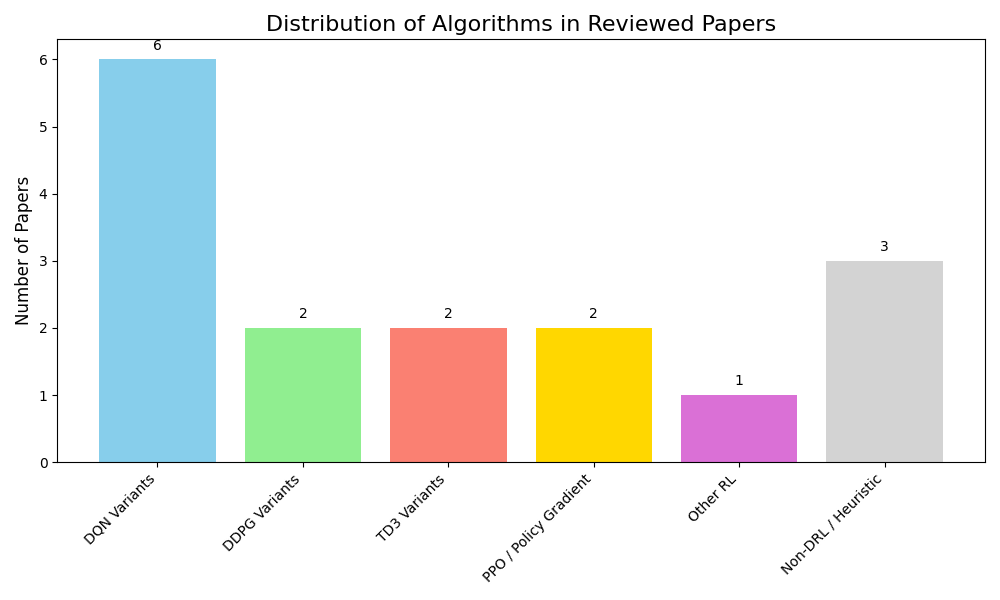
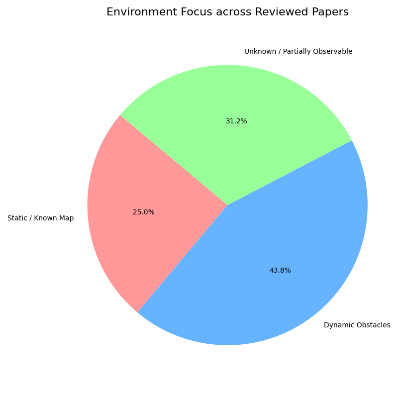

# A Review on Deep Reinforcement Learning-Based UAV Navigation and Conflict Resolution in Unknown Environments (Expanded)

**Authors:** Harshvardhan Pandey, Adya Chauhan, Yash Prasad (Original) + [Contributor]

## Abstract
Unmanned Aerial Vehicles or UAVs have become very popular. They have found applications in diverse fields including surveillance, disaster response, logistics, and inspections of unsafe situations and defense missions. However, their ability to navigate through complex, dynamic environments in case of communication loss is important. Traditional approaches lack adaptability and are computationally expensive. In response to this, researchers have integrated Deep Reinforcement Learning (DRL) techniques. This paper reviews sixteen studies on DRL-based and hybrid approaches for UAV navigation and collision avoidance. They are analyzed based on problem formulation, approaches, architectural innovations, performance, and real-world applications. A comparative study is provided evaluating their strengths, limitations, and potential for future research.

## 1. Introduction
### Background and Motivation
Unmanned aerial vehicles (UAVs), widely known as drones, have come to occupy a vital place in today's automation environment. Their compactness and easy maneuverability at an ever-decreasing cost have opened their applications into the domains of military, commercial, and industrial. One such huge challenge is the autonomous navigation of these vehicles in entirely unknown or partly known environments. Classical path generation techniques like A*, Rapidly exploring random trees (RRT), and artificial potential fields have the limitation of being dependent on pre-existing maps and are computationally inefficient in dynamic environments. They are designed and trained for static ideal-world scenarios, making them unreliable in unknown environments.

Deep reinforcement learning (DRL) is a promising paradigm that has transformed the approach to solving navigation problems. This approach allows agents to learn optimal policies through experiences accumulated in simulated environments, notwithstanding the criteria of partial observability and dynamic constraints. Thus, DRL has allowed navigation policy learning that signifies selection of optimal policy based on prior training. Integrating high-dimensional inputs such as images and LIDAR data while accommodating real-time decision-making without exhaustive path computation makes these models ideal for dynamic environments.

### Objectives and Scope
This review critically analyzes sixteen key papers, including the original six studies and ten additional works:

1. Deep-reinforcement-learning-based UAV autonomous navigation and collision avoidance in unknown environments (FRDDM-DQN)
2. Adaptive Multi-Agent Reinforcement Learning Solver for Tactical Conflict Resolution
3. UAV Navigation in 3D Urban Environments with Curriculum-based Deep Reinforcement Learning
4. Combining Motion Planner and Deep Reinforcement Learning for UAV Navigation in Unknown Environment
5. Autonomous UAV Navigation with Adaptive Control Based on Deep Reinforcement Learning
6. Multi-Level-Frontier Empowered Adaptive Path Planning for UAVs in Unknown Environments
7. APPA-3D: an autonomous 3D path planning algorithm for UAVs in unknown complex environments
8. Agile DQN: adaptive deep recurrent attention reinforcement learning for autonomous UAV obstacle avoidance
9. Autonomous UAV Visual Navigation Using an Improved Deep Reinforcement Learning
10. SIGN: Safety-Aware Image-Goal Navigation for Autonomous Drones via Reinforcement Learning
11. Autonomous localized path planning algorithm for UAVs based on TD3 strategy
12. Deep reinforcement learning-based controller for path following of an unmanned surface vehicle
13. A multi-critic deep deterministic policy gradient UAV path planning
14. Unmanned Aerial Vehicle Path Planning Algorithm Based on Deep Reinforcement Learning in Large-Scale and Dynamic Environments
15. Collaborative Path Planning for Multiple Unmanned Aerial Vehicles to Avoid Sudden Threats
16. Cooperative control of UAV swarm via information measures

Each paper is analyzed with respect to problem formulation, model architecture, training methodology, evaluation metrics, and experimental outcomes.

## 2. Literature Review
The integration of Deep Reinforcement Learning (DRL) in the field of Unmanned Aerial Vehicles has attracted significant attention particularly based on partially observable and dynamic environments. Wang et al. [1] proposed the FRDDM-DQN framework that integrated Faster R-CNN for visual obstacle detection and DQN. Fremond et al. [2] utilized MARL with PPO for tactical conflict resolution. Carvalho et al. [3] implemented curriculum learning in DQN. Xue and Chen [4] combined DRL with a motion planner. Yin et al. [5] introduced GARTD3 with attention mechanisms. Duan et al. [6] described a non-learning-based method using multi-level octree voxelization.

Beyond these, recent advancements include Wang et al. [7] with APPA-3D using dynamic rewards, AlMahamid et al. [8] proposing Agile DQN with attention mechanisms, and Samma et al. [9] introducing a two-stage learning process with self-supervised learning. Other notable works explore safety-aware navigation [10], TD3 strategies for local planning [11], and multi-critic architectures [13]. While most focus on DRL, some studies explore heuristic collaborative planning [15] and information-theoretic decentralized control [16], providing a broader perspective on the field.

## 3. In-Depth Analysis of Selected Works

### 3.1 FRDDM-DQN for UAV Navigation and Obstacle Avoidance [1]
**Problem Statement**: This work is concerned with autonomous UAV navigation in GPS-denied environments in which traditional sensors, like radar, are compromised. The challenge is obstacle avoidance using visual information.
**Methodology**: The authors introduce a hybrid architecture including Faster R-CNN for visual detection, DQNs for learning policies, and a Data Deposit Mechanism (DDM) for prioritizing experience replay. Training occurs in a 3D simulation.
**Innovations**: Use of DDM to retain safety-critical experiences and a two-stage training pipeline.
**Results**: Outperformed YOLO-based methods and DQN variants, achieving improved navigation success.
**Limitations**: Entirely simulation-based; heavy computational costs from object detection.

### 3.2 Adaptive Multi-Agent Reinforcement Learning [2]
**Problem Statement**: Targets tactical conflict resolution (TCR) of UAVs within a shared urban airspace (decentralized UTM).
**Methodology**: MARL framework based on PPO with RNNs (CTDE paradigm).
**Innovations**: Centralized training with decentralized execution; handling varying intruder scenarios.
**Limitations**: Assumes full state observability and perfect communication.

### 3.3 Curriculum-based DRL in 3D Urban Environments [3]
**Problem Statement**: To navigate a broad expanse of 3D urban constructs with concerns on navigation and energy-optimization.
**Methodology**: Curriculum learning with Deep Q-Learning in simulated 3D maps.
**Innovations**: Stepwise difficulty increase improves generalization.
**Limitations**: No temporal modeling (LSTM), affecting dynamic performance.

### 3.4 RLPlanNav (Hybrid DRL + Motion Planner) [4]
**Problem Statement**: Combining high-level planning with low-level motion control.
**Methodology**: Top-level DRL agent combined with EGO-planner for trajectory generation.
**Innovations**: Hierarchical architecture complementing learning-based decision making with deterministic planning.
**Limitations**: Tested in static environments; doubts on dynamic applicability.

### 3.5 Autonomous UAV Navigation with Adaptive Control (GARTD3) [5]
**Problem Statement**: Adaptive control in 3D environments with velocity constraints.
**Methodology**: Guide Attention TD3 (GARTD3) with LSTM and attention module.
**Innovations**: Attention mechanism for navigation-obstacle avoidance balancing.
**Limitations**: High computational demands and sensitivity to hyperparameters.

### 3.6 Multi-Level-Frontier Empowered Adaptive Path Planning [6]
**Problem Statement**: Efficient path planning in unknown environments.
**Methodology**: Non-learning-based method using multi-level octree voxelization and Historical State Record Tree (HSRT).
**Innovations**: Multi-resolution voxel modeling.
**Limitations**: Heuristic nature lacks adaptability of DRL.

### 3.7 APPA-3D: Autonomous 3D Path Planning [7]
**Problem Statement**: Path planning in unknown complex 3D environments requiring collision avoidance and handling unknown information.
**Methodology**: APPA-3D algorithm using DRL with a dynamic reward function and improved exploration strategy based on action selection probability.
**Innovations**: Dynamic reward function tailored to the flight environment and optimized action exploration.
**Results**: Effective collision-free path planning from start to target in unknown 3D environments.
**Limitations**: Reliance on simulated environments for training.

### 3.8 Agile DQN: Adaptive Deep Recurrent Attention RL [8]
**Problem Statement**: UAV obstacle avoidance in 3D environments with high-dimensional inputs and partial observability.
**Methodology**: Agile DQN (AG-DQN) synergizing Glimpse Network, LSTM, Emission Network, and Q-Network.
**Innovations**: Dynamic focus on key visual features (Attention) and adaptive temporal attention strategy.
**Results**: Improved performance over existing DRL methods in navigation success and robustness.
**Limitations**: Complex architecture increases computational requirements.

### 3.9 Autonomous UAV Visual Navigation Using Improved DRL [9]
**Problem Statement**: Navigation in dynamic environments with moving objects; traditional DRL suffers from slow learning.
**Methodology**: Two-stage learning: (1) Reinforced learning (DQN), (2) Self-supervised learning (Contrastive loss) to fine-tune backbone.
**Innovations**: Integration of self-supervised learning to speed up encoding of input scenes.
**Results**: Faster learning and better navigation performance in dynamic situations.
**Limitations**: Two-stage training process adds complexity.

### 3.10 SIGN: Safety-Aware Image-Goal Navigation [10]
**Problem Statement**: Image-Goal Navigation in cluttered environments where collisions are costly.
**Methodology**: Safety-Aware Image-Goal Navigation (SIGN) using Reinforcement Learning with safety constraints.
**Innovations**: Safety-aware mechanism integrated into the navigation policy; end-to-end image-based navigation.
**Results**: Achieved navigation goals while minimizing collision risks.
**Limitations**: Image-based navigation can be sensitive to lighting; potential blind spots.

### 3.11 Autonomous Localized Path Planning based on TD3 [11]
**Problem Statement**: Local path planning in unfamiliar environments; issues with consistency and native controller influence.
**Methodology**: TD3 (Twin Delayed DDPG) strategy for continuous control.
**Innovations**: Application of TD3 strategy for autonomous local path planning addressing overestimation bias.
**Results**: Success rate of 93% (no obstacles) and 92% (with obstacles) in Gazebo simulations.
**Limitations**: Focuses on local planning; might need global planner integration.

### 3.12 Deep RL Controller for USV Path Following [12]
**Problem Statement**: Path following for Unmanned Surface Vehicles (USV) in complex environments.
**Methodology**: DDPG (Deep Deterministic Policy Gradient) with custom MDP.
**Innovations**: Validated through full-scale free-running tests of a USV.
**Results**: Successful path following in simulation and real-world tests.
**Limitations**: Application is USV (2D), not UAV (3D).

### 3.13 Multi-Critic DDPG UAV Path Planning [13]
**Problem Statement**: Environmental sensitivity and slow convergence in DDPG-based path planning.
**Methodology**: Improved DDPG with Multi-Critic architecture.
**Innovations**: Multi-critic mechanism to reduce variance and improve stability.
**Results**: Improved convergence speed and stability.
**Limitations**: Increased computational cost due to multiple critic networks.

### 3.14 UAV Path Planning in Large-Scale Environments [14]
**Problem Statement**: Path planning in large-scale, dynamic environments with limited sensors (POMDP).
**Methodology**: DRL with Recurrent Neural Network (RNN) and adaptive experience replay based on failure frequency.
**Innovations**: Use of RNN for temporal memory and adaptive experience replay.
**Results**: Significant improvements over DQN and DRQN in stability and efficiency.
**Limitations**: Partial observability challenges remain.

### 3.15 Collaborative Path Planning to Avoid Sudden Threats [15]
**Problem Statement**: Multi-UAV path planning with sudden threats requiring rapid re-planning.
**Methodology**: V-Diagram, mission assignment model, cubic spline, and crowding mechanism (Non-DRL).
**Innovations**: Combination of V-diagram and mission assignment; secondary security screening.
**Results**: Effective avoidance of sudden threats.
**Limitations**: Heuristic methods may not generalize as well as learning-based methods.

### 3.16 Cooperative Control of UAV Swarm via Information Measures [16]
**Problem Statement**: Decentralized control of UAV swarms for cooperative missions.
**Methodology**: Rule-based decentralized control using information theoretic measures (Non-DRL).
**Innovations**: Use of information measures to estimate value of future actions without central authority.
**Results**: Highly cooperative performance.
**Limitations**: Performance depends on task constraint complexity.

## 4. Comparative Analysis

This section compares all sixteen approaches based on their algorithms, environment types, and key innovations.

### Algorithm Distribution

*Fig. 1: Distribution of Algorithms across the 16 reviewed papers. DQN variants remain the most popular, followed by DDPG and TD3.*

### Environment Focus

*Fig. 2: Environment Focus: A significant portion of research addresses dynamic and unknown environments.*

### Key Comparison Table (Summary)
| Paper | Algorithm | Input/State | Environment | Key Innovation |
|---|---|---|---|---|
| [1] Wang et al. | FRDDM-DQN | Visual | 3D Sim (Dynamic) | Faster R-CNN + DDM |
| [2] Fremond et al. | MARL (PPO) | Positional | Urban Airspace | Centralized Training |
| [3] Carvalho et al. | Curriculum DQN | 3D Map | 3D Urban | Curriculum Learning |
| [4] Xue & Chen | Hybrid (DQN+Planner) | RGB + Partial Map | Static | Hierarchical Planning |
| [5] Yin et al. | GARTD3 | 3D Coords | Complex 3D | Attention Mechanism |
| [6] Duan et al. | Multi-Level Planner | Voxel Map | Unknown | Multi-resolution Voxel |
| [7] Wang et al. | APPA-3D (RL) | Sensors | Unknown 3D | Dynamic Reward |
| [8] AlMahamid et al. | Agile DQN | Visual | 3D Sim | Attention + LSTM |
| [9] Samma et al. | Improved DQN | Visual | Dynamic | Self-Supervised Learning |
| [10] Yan et al. | SIGN (RL) | Image | Cluttered | Safety-Awareness |
| [11] Zhao et al. | TD3 | Local State | Unfamiliar | TD3 Strategy |
| [12] Woo et al. | DDPG | USV State | Real USV | Real-world Validation |
| [13] Wu et al. | Multi-Critic DDPG | State | Complex | Multi-Critic |
| [14] Xie et al. | DRQN | POMDP | Large-Scale | Adaptive Replay |
| [15] Chen et al. | V-Diagram (Heuristic) | Threat Info | Multi-UAV | V-Diagram + Crowding |
| [16] Cheng et al. | Info Measures (Rule) | Local Info | Swarm | Information Theory |

## 5. Conclusion
This expanded review analyzed sixteen studies on UAV navigation, ranging from DRL-based methods like DQN, DDPG, and TD3 to heuristic and rule-based approaches. The trend shows a strong move towards handling dynamic and unknown environments using advanced mechanisms like Attention, Recurrent Neural Networks (LSTM/RNN), and Hybrid architectures. While simulation remains the primary testing ground, some studies [12] are bridging the gap to real-world deployment. Future research should focus on computational efficiency for on-board processing and more robust real-world validation.
